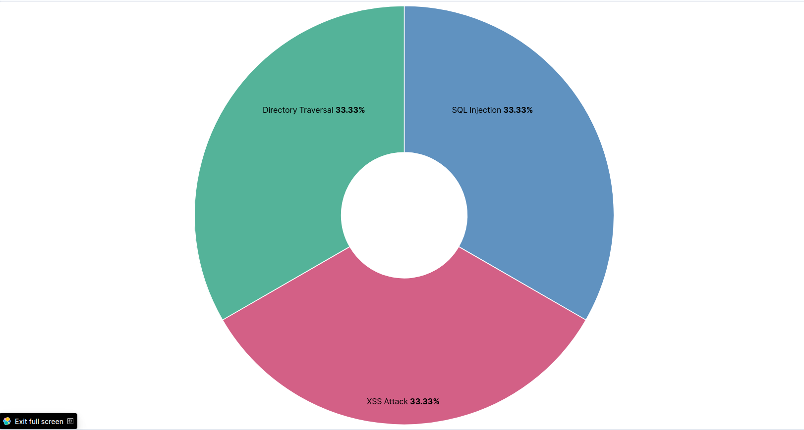
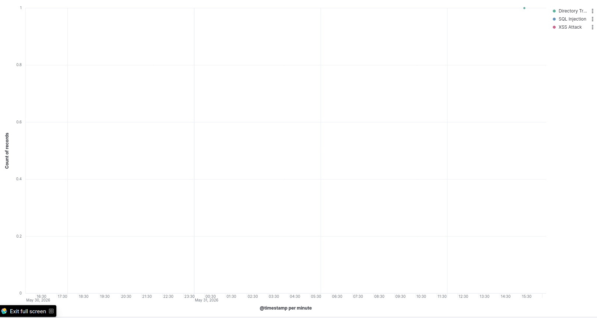
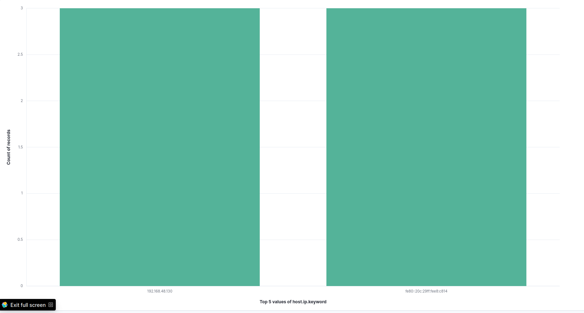
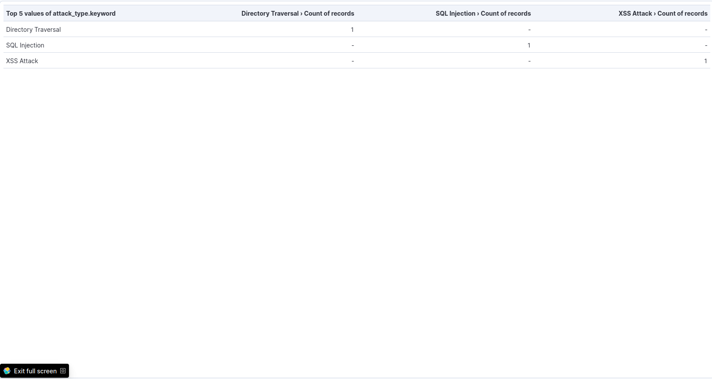
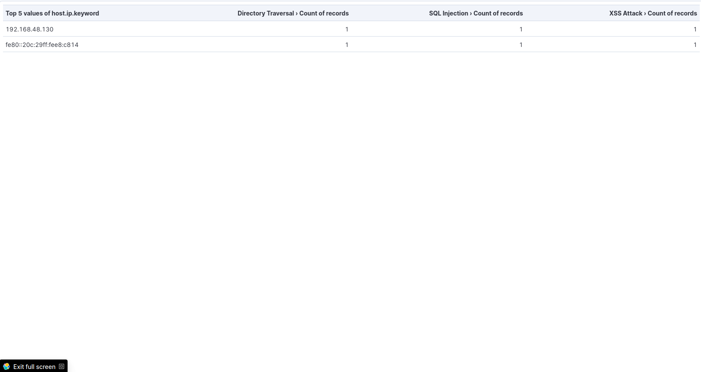

# ELK Web Attack Detection

## Project Overview
Real-Time Web Attack Detection and Visualization using ELK Stack.

This project detects and visualizes web attacks using Elasticsearch, Logstash, Kibana, and Filebeat.

---

## Attack Types Detected

- SQL Injection
- Cross-Site Scripting (XSS)
- Directory Traversal

---

## Key Features

- Real-time log ingestion
- Attack classification
- Source IP monitoring
- Timeline analysis
- Interactive dashboards

---

## Dashboard Screenshots

### Attack Distribution

### Attack Timeline

### Source IP Distribution

### Attack Summary Table

### Attack Source Correlation

---

## Detection Workflow

1. Apache logs generated
2. Filebeat collects logs
3. Logstash parses attack patterns
4. Elasticsearch indexes data
5. Kibana visualizes detections

---

## Skills Demonstrated

- ELK Stack
- SIEM Monitoring
- Threat Detection
- Log Analysis
- Dashboard Creation
- Security Monitoring
